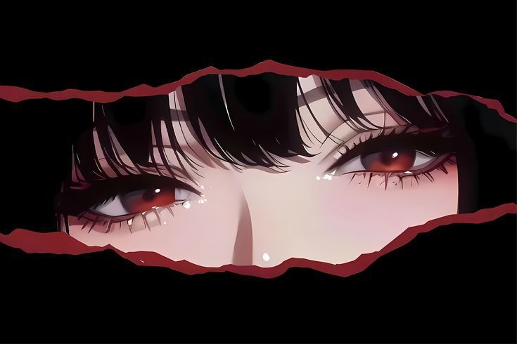

<div align="center">
  
  
  
  # 

</div>

<p align="center">
  
  
  
</p>

---

<div align="center">
  
  
</div>

---

## 👋 About Me

<div align="left">

- 💎 **Pronouns:** She/Her  
- 🤖 **Passion:** Building intelligent bots, AI automation & creative tech solutions  
- 🧠 **Currently Learning:** Advanced JavaScript & Natural Language Processing  
- 💌 **Contact:** 
  - 📧 Email: [vynaachan@gmail.com](mailto:vynaachan@gmail.com)
  - 📱 WhatsApp: +6282389924037  
- 🎂 **GitHub Member Since:** 2010  
- ✨ **2024 Contributions:** 4,206+ commits

</div>

---

## 🚀 Tech Stack & Tools

<div align="center">

### 🔧 Languages & Frameworks


### 🛠️ Tools & Platforms  


### 🤖 Specializations
`Discord Bots` • `ChatGPT Integration` • `Node.js` • `Automation` • `AI/ML` • `Real-time Systems`

</div>

---

## 📊 GitHub Analytics

<div align="center">

<table>
  <tr>
    <td align="center" width="50%">
      
    </td>
    <td align="center" width="50%">
      
    </td>
  </tr>
</table>

</div>

<div align="center">
  
  

</div>

<div align="center">
  
  

</div>

---

## 🌟 Featured Projects

<div align="center">

| 🎯 Project | 📝 Description | 🔗 Links |
|-----------|---------------|---------|
| **Bot Development** | Intelligent Discord & Telegram bots with AI integration | [View Repos](https://github.com/VynaaValerie?tab=repositories) |
| **ChatGPT Solutions** | Custom ChatGPT integration & AI automation tools | [View Repos](https://github.com/VynaaValerie?tab=repositories) |
| **Creative Tech** | Innovative solutions blending creativity & technology | [View Repos](https://github.com/VynaaValerie?tab=repositories) |

</div>

---

## 💬 What I'm Working On

```
🤖 Building next-generation AI-powered automation tools
🎨 Creating seamless bot-to-user experiences
📚 Exploring advanced NLP & machine learning applications
🌐 Contributing to open-source projects
```

---

## 🎯 Statistics Overview

<div align="center">

```text
📦 Public Repositories    : 59+
🔐 Private Repositories   : 12+
⭐ Most Used Language     : JavaScript
🎯 Primary Focus          : Bot Development & AI
🚀 Deployment Skills      : Node.js, Discord.js, Telegram API
💡 Problem-solving        : Creative & Efficient Solutions
```

</div>

---

## 🔗 Connect With Me

<div align="center">

<a href="https://github.com/VynaaValerie">
  
</a>
<a href="mailto:vynaachan@gmail.com">
  
</a>
<a href="https://wa.me/6282389924037">
  
</a>

</div>

---

## ✨ Fun Facts

<div align="center">

```
💻 Code is my canvas, creativity is my brush
🎭 I believe in making technology fun and accessible
🌍 Passionate about building tools that help others
🔥 Always learning, always growing, never stopping
```


</div>

<div align="center">
  <sub>✨ Made with 💖 | Last Updated: December 2025</sub>
</div>
